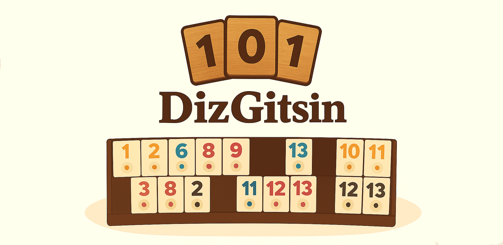
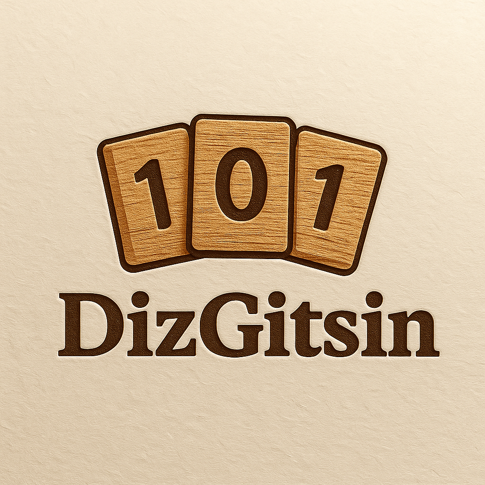
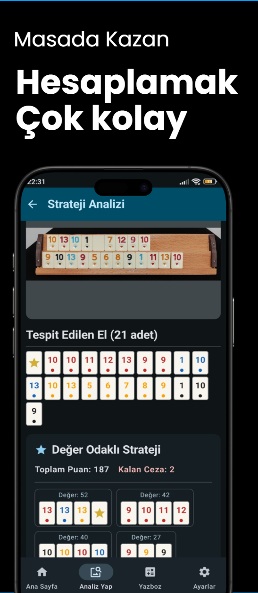
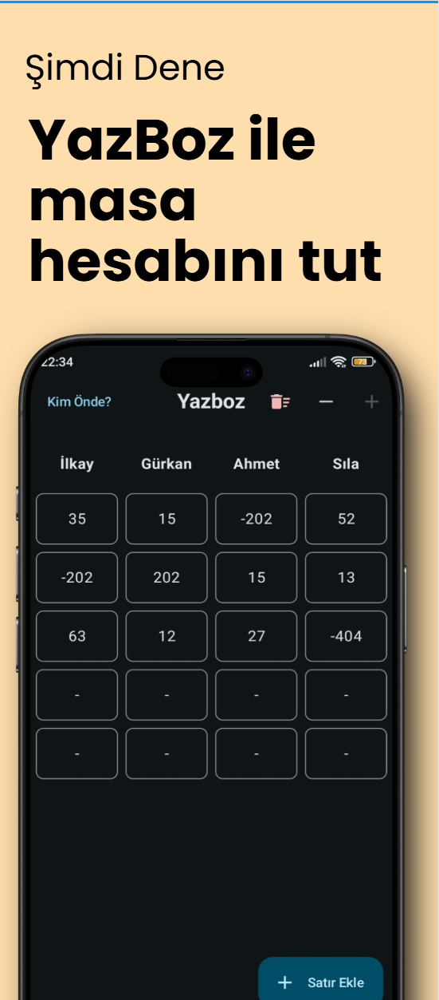
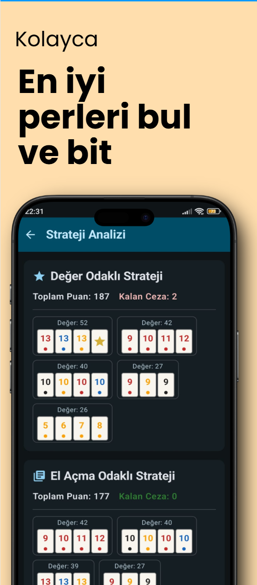
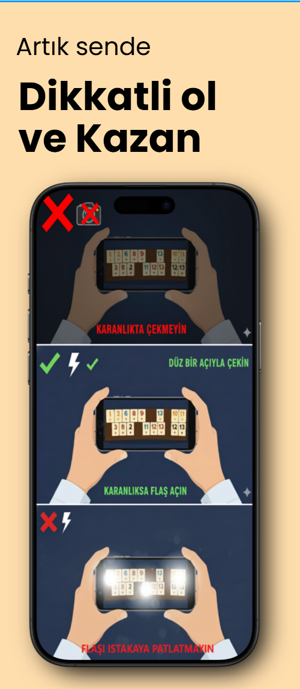

  

  

<h1 align="center">DizGitsin - Akıllı Okey 101 Yardımcısı</h1>

  Okey 101 oyununuza teknoloji katın! Istakanızın fotoğrafını çekin, yapay zeka en iyi perleri ve stratejileri saniyeler içinde sizin için bulsun.

  

  <strong>Uygulama şu anda Google Play'de Kapalı Beta sürecindedir.</strong>

---

## ✨ DizGitsin ile 101 Keyfi

<table>
  <tr>
    <td align="center">
      <strong>Akıllı Strateji Analizi</strong>  
      
    </td>
    <td align="center">
      <strong>Entegre YazBoz Puan Tablosu</strong>  
      
    </td>
  </tr>
  <tr>
    <td align="center">
      <strong>Detaylı Sonuç Ekranı</strong>  
      
    </td>
    <td align="center">
      <strong>Doğru Çekim Rehberi</strong>  
      
    </td>
  </tr>
</table>

-   📸 **Yapay Zeka Destekli Istaka Analizi:** Telefonunuzun kamerasıyla çektiğiniz ıstaka fotoğrafını analiz ederek taşlarınızı (sayı ve renk) otomatik olarak tanır.
-   🧠 **İki Farklı Strateji Modu:**
    -   **Değer Odaklı:** Elinizdeki perlerin toplam değerini en yükseğe çıkaran kombinasyonları bulur.
    -   **El Açma Odaklı:** Oyunu bitirmeye veya en az ceza puanıyla el açmaya yönelik en verimli stratejiyi sunar.
-   🔢 **Entegre YazBoz:** Oyun skorlarını kolayca takip edebileceğiniz, oyuncu ekleyip çıkarabileceğiniz dijital bir puan tablosu.
-   💡 **Kullanıcı Dostu Rehberlik:** En iyi analiz sonuçları için ıstaka fotoğrafını nasıl çekmeniz gerektiği konusunda size yol gösterir.
-   🚀 **Hızlı ve Optimize:** Gelişmiş kombinatoryal optimizasyon algoritmaları sayesinde en karmaşık elleri bile saniyeler içinde analiz eder.

---

## 🏗️ Teknik Mimari ve Teknoloji Akışı

Bu proje, modern ve ölçeklenebilir bir mobil uygulama mimarisi üzerine kurulmuştur. Kullanıcının çektiği görüntü, güvenli bir şekilde backend sunucusuna gönderilir ve yapay zeka modelleri tarafından işlenerek sonuçlar JSON formatında uygulamaya geri döndürülür.

---

## 🛠️ Kullanılan Teknolojiler

Projenin geliştirilmesinde aşağıdaki teknolojiler ve kütüphaneler kullanılmıştır:

| Kategori | Teknolojiler |
| :--- | :--- |
| **Android (Frontend)** |     |
| **Backend & Yapay Zeka** |      |

---

## 📲 Beta Programına Katılın

DizGitsin şu anda **Kapalı Beta** aşamasındadır. Uygulamayı denemek ve geri bildirimlerinizle gelişimine katkıda bulunmak isterseniz, aşağıdaki link üzerinden beta programına katılabilirsiniz.

  

---

## irtibata geçin

Herhangi bir soru, öneri veya işbirliği için benimle iletişime geçebilirsiniz: **[dizgitsin@gmail.com]**

---

## 📜 Lisans

Bu projenin kaynak kodları kapalıdır ve tüm hakları saklıdır.